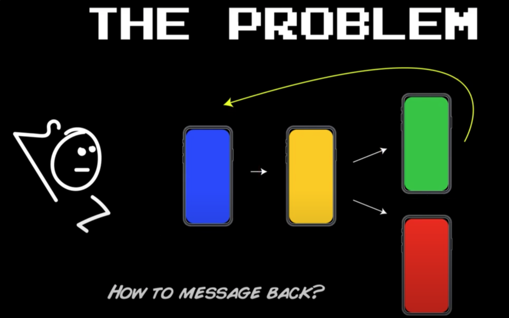

# Responder Chain
It’s sometimes a bit more elegant than a protocol **delegate**, and in certain cases, it's just a better fit for communicating back and forth between your view controllers.  

### Quick Start
There are four functions in ResponderExtensions.swift, any of which you can comment out to test how the responder chain works.

### Reference
* [Using responders and the responder chain to handle events](https://developer.apple.com/documentation/uikit/touches_presses_and_gestures/using_responders_and_the_responder_chain_to_handle_events)
* [What is the Responder Chain and How Does it Work?](https://www.youtube.com/watch?v=le7tzeqN908)